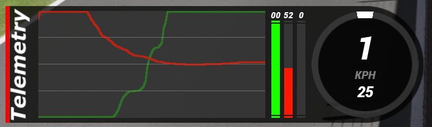
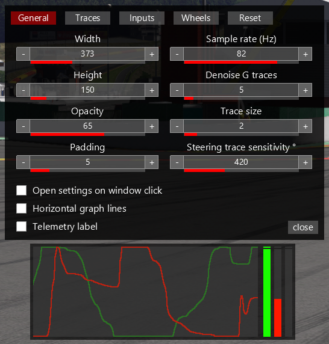

# AC Telemetry overlay

Assetto Corsa app that show car telemetry in a graph with many config options. Is compatible with vanilla Assetto Corsa, but works best when using Custom Shaders Patch.

### Features

- Traces
  - Throttle
  - Brake
  - Clutch
  - Handbrake
  - Steering
  - G forces
  - Force feedback
- Pedal inputs
- Wheel
- Fully customizable

## Installation

- Download the zip from [Overtake.gg here](https://www.overtake.gg/downloads/ac-pedal-telemetry-overlay.67630/).
- Copy its content into you your `assettocorsa` folder, or simply drag to zip file into Content Manager if you are using that
- Enable the app in the menu

Or manually create a release zip from source:

- Download the source code
- run `create_zip.ps1 telemetry_overlay <<VERSION>>`

## Settings

Clicking the left side of the window opens/closes the settings window.
 
Trace size can only be changed when using Custom Shaders Patch.

Settings are saved to `config.ini` inside the apps folder and can also be changed there if you prefer working with a config file.
