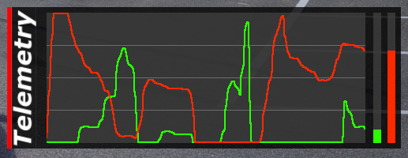
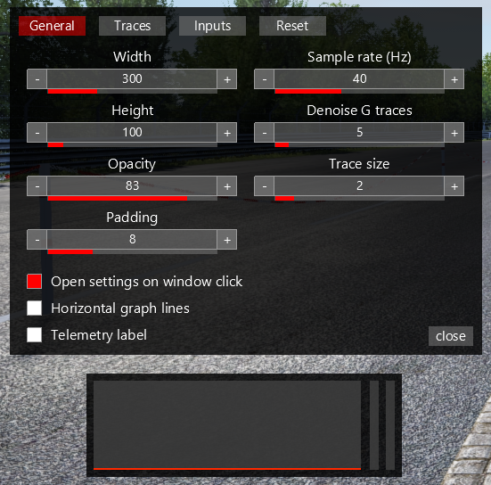

# AC Telemetry overlay

Assetto Corsa app that show car telemetry in a graph with many config options. Is compatible with vanilla Assetto Corsa, but works best when using Custom Shaders Patch.
 
Includes Gas, Throttle, Brake, Steering, Lateral and Longitudinal G traces.

## Installation

Download the zip from Racedepartment. Or manually create a releaes zip install:

- Download the source code
- run `create_zip.ps1`
- Copy its content into you your `assettocorsa` folder, or simply drag to zip file into Content Manager if you are using that
- Enable the app in the menu

## Settings

Clicking the left side of the window opens/closes the settings window.
 
Trace size can only be changed when using Custom Shaders Patch.

Settings are saved to `config.ini` inside the apps folder and can also be changed there if you prefer working with a config file.
