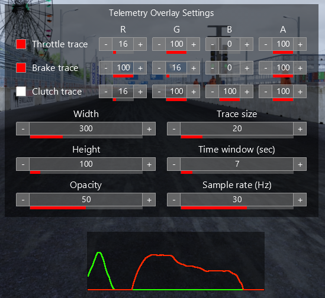

# AC Pedal telemetry overlay

Assetto Corsa app that show the pedal telemetry in a graph with many config options.

## Installation

- Download the source code
- Copy `telemetry_overlay` into the `apps/python` of your `assettocorsa` folder
- Enable the app in the menu

## Settings

Clicking the left side of the window opens/closes the settings window.

Settings are saved to `config.ini` inside the apps folder and can also be changed there if you prefer working with a config file.
